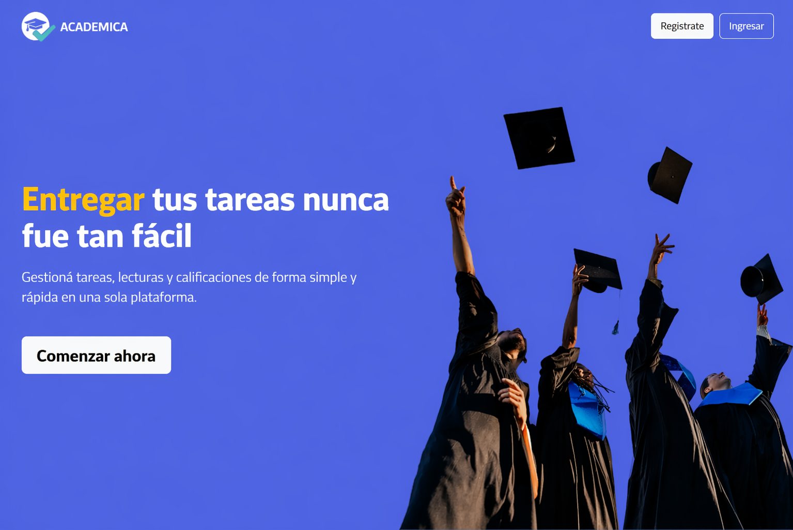
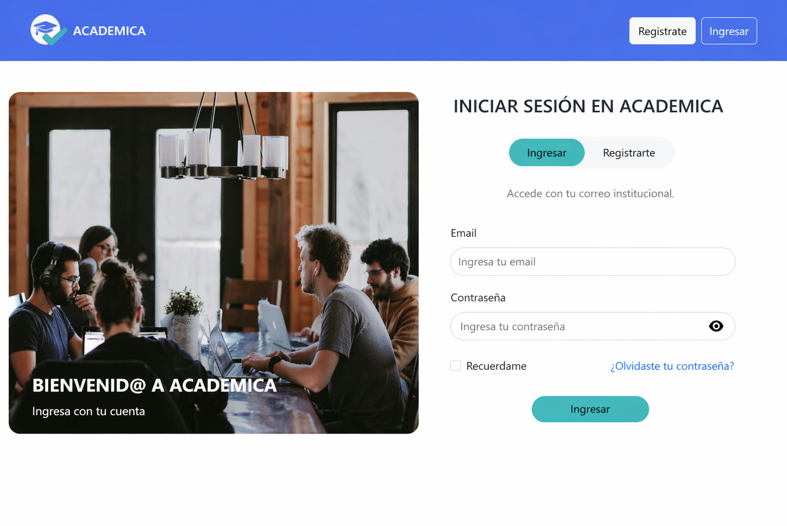

#  Academica

Aplicación web para la gestión de tareas, lecturas y calificaciones en entornos académicos.

Permite a estudiantes y docentes centralizar la entrega de tareas, el seguimiento de contenido y la organización académica en una sola plataforma.

---

##  Funcionalidades

- Registro e inicio de sesión de usuarios
- Gestión de tareas y entregas
- Visualización de lecturas y contenido académico
- Interfaz orientada a simplicidad y usabilidad

---

##  Tecnologías

- Frontend: React + Vite
- Backend: Python + Flask
- Base de datos: SQLAlchemy
- Autenticación: JWT

---

##  Screenshots

---

##  Equipo

Proyecto desarrollado en equipo como parte de formación Full Stack.

Esta versión fue reorganizada y adaptada individualmente para su uso como portfolio.

---

##  Estado del proyecto

El frontend se encuentra funcional y permite navegar la interfaz.

Algunas funcionalidades dependen del backend, que requiere configuración adicional para su ejecución completa.

---

##  Repositorio

https://github.com/Sebaperez12/academica-app
